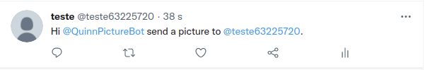

# Simple Twitter Image Bot


## About
The purpose of this bot is send a picture to a friend using a tweet like that:
Hi @bot_screen_name send a picture to @friend_screen_name.
These pictures will be search at a local directory and randomly chosen!

## Technologies
- Python
- [Twitter API](https://python-twitter.readthedocs.io/en/latest/index.html)

## Dependencies
Create the virtual machine
```
python3 venv virtual_machine_name
```

Activate venv
```
source venv/bin/activate
```

Run requirements.txt
```
pip install -r requirements.txt
```

## How to use

Basic Command



Response


## About storage pictures

The storage is local and the directory is on gitignore. So you need your own directory of pictures on your computer!